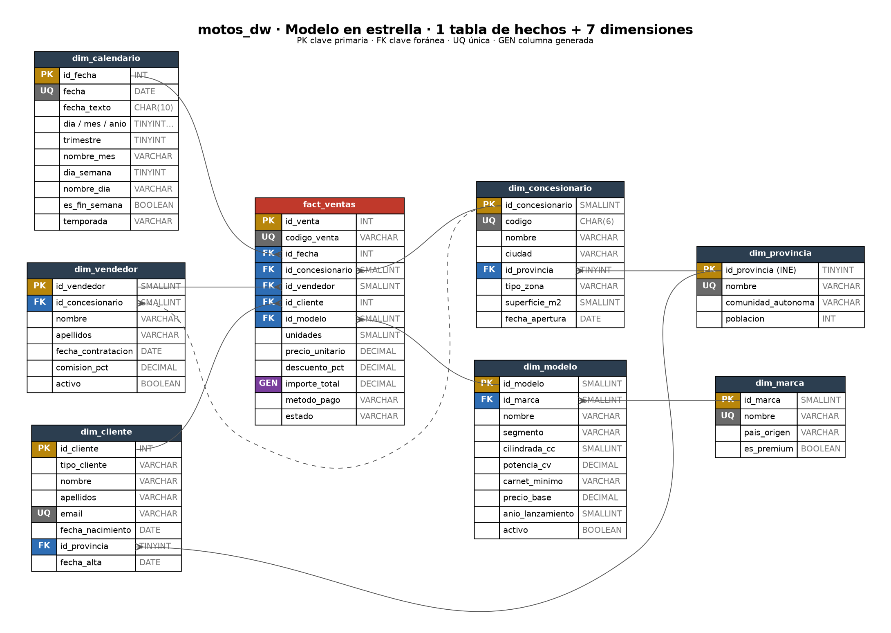

# 🏍️ Red de concesionarios de motos · Diseño de BBDD relacional y EDA en SQL

Proyecto del **Módulo 2 (SQL)** del Máster en Data Science & IA de Evolve Academy.

Se diseña, implementa y analiza una base de datos relacional (MySQL) para una red ficticia de **12 concesionarios de motos en España**, con las ventas de **2024 y 2025**. El objetivo es que el modelo sea coherente, que los datos sean íntegros y que el análisis en SQL responda a preguntas de negocio reales: dónde abrir un nuevo concesionario, qué producto potenciar, cuándo reforzar plantilla o por qué se pierden ventas.

---

## 📁 Estructura del repositorio

| Archivo | Contenido |
|---|---|
| `01_schema.sql` | Base de datos, 8 tablas, constraints, índices, 3 funciones y la vista de detalle. Todo comentado. |
| `02_data.sql` | Carga de datos por transacciones, staging, limpieza (INSERT / UPDATE / DELETE, CAST) y demostración de ROLLBACK. |
| `03_eda.sql` | **Núcleo del proyecto.** 11 bloques de análisis con insights comentados y la vista resumen final. |
| `model.png` | Diagrama entidad-relación. |
| `scripts/gen_data.py` | Generador reproducible (semilla fija) que produce `02_data.sql`. |

## ▶️ Cómo ejecutarlo

Requisito: **MySQL 8.0.29 o superior** (por `CHECK`, CTE, funciones ventana y `CREATE FUNCTION IF NOT EXISTS`).

**MySQL Workbench:** abrir y ejecutar (⚡) los tres scripts en orden: `01_schema.sql` → `02_data.sql` → `03_eda.sql`.

**Terminal:**
```bash
mysql -u root -p < 01_schema.sql
mysql -u root -p < 02_data.sql
mysql -u root -p < 03_eda.sql
```

Los scripts son **re-ejecutables desde cero**: `01_schema.sql` borra y recrea todo con `DROP ... IF EXISTS` / `CREATE ... IF NOT EXISTS`, así que se pueden lanzar tantas veces como se quiera sin errores. Se usa `DELIMITER` para las funciones, por lo que se recomienda Workbench o la terminal.

---

## 🧱 Modelo de datos



Se ha elegido un **modelo en estrella**, el estándar para bases de datos analíticas:

- **Tabla de hechos** (`fact_ventas`): registra *eventos* medibles. Cada fila es una venta y contiene las **métricas** que se suman o promedian (unidades, precio, descuento, importe) y las **claves** hacia las dimensiones.
- **Tablas de dimensiones** (`dim_*`): describen el *contexto* de cada venta (quién, qué, dónde, cuándo). Contienen los atributos por los que se filtra y agrupa.

| Tabla | Tipo | Granularidad (1 fila =) | Filas |
|---|---|---|---:|
| `fact_ventas` | Hechos | una línea de venta: un modelo vendido a un cliente, en un concesionario, un día | 2.405 |
| `dim_calendario` | Dimensión | un día (01/01/2024 – 31/12/2025) | 731 |
| `dim_cliente` | Dimensión | un cliente del CRM, particular o empresa (incluye leads sin compra) | 2.708 |
| `dim_modelo` | Dimensión | un modelo comercial | 51 |
| `dim_marca` | Dimensión | un fabricante | 12 |
| `dim_concesionario` | Dimensión | un concesionario propio | 12 |
| `dim_vendedor` | Dimensión | un comercial | 41 |
| `dim_provincia` | Dimensión | una provincia (código INE) | 15 |

### Alcance

- **Dentro:** venta de motos nuevas a particulares y empresas en la red propia, enero 2024 – diciembre 2025.
- **Fuera:** taller y postventa, recambios, motos de ocasión, stock e inventario, y costes o márgenes (no se dispone del precio de compra al fabricante).

---

## 🧠 Decisiones de diseño

### Claves primarias

| Decisión | Dónde | Por qué |
|---|---|---|
| Clave *surrogate* `AUTO_INCREMENT` | marca, modelo, concesionario, vendedor, cliente, ventas | Numérica, compacta y estable: si cambia un nombre o un código no hay que propagarlo a miles de filas. |
| Clave natural oficial | `dim_provincia.id_provincia` = código INE | Es un código estable y estándar; permite cruzar con datos públicos del INE. |
| Clave "inteligente" `AAAAMMDD` | `dim_calendario.id_fecha` | Convención de data warehouse: legible (20250315), ordena como la fecha y es un entero ligero en los JOIN. |
| Clave de negocio como `UNIQUE` | `codigo_venta`, `codigo` de concesionario, `email` del cliente | Se conserva el identificador del sistema de origen para enlazar datos y **evitar cargar dos veces la misma venta**. |

### Claves foráneas

Todas las FK de `fact_ventas` son `NOT NULL`: no puede existir una venta sin fecha, cliente, modelo, concesionario o comercial. Se usa `ON DELETE RESTRICT` en todas: una dimensión con ventas **no se puede borrar**, porque se perdería el histórico. Para retirar un modelo o dar de baja a un comercial se marca `activo = FALSE` en lugar de borrar. `ON UPDATE CASCADE` propaga un posible cambio de clave.

### Constraints

- `NOT NULL` en todos los campos obligatorios.
- `UNIQUE` en nombres y códigos que no deben repetirse, incluida la clave compuesta `(id_marca, nombre)` del modelo.
- `CHECK` para dominios cerrados (segmento, carnet, método de pago, estado, temporada), rangos (descuento entre 0 y 25 %, días 1-31…) y una **regla condicional**: un particular necesita fecha de nacimiento, una empresa no.
- `DEFAULT` para valores habituales: `unidades = 1`, `descuento = 0`, `estado = 'Completada'`, `activo = TRUE`, `fecha_alta = CURRENT_DATE`.
- **Columna generada** `importe_total` = unidades × precio × (1 − descuento): se calcula sola y nunca puede quedar incoherente.

### Normalización

- Las dimensiones están en **3FN**. La comunidad autónoma vive en `dim_provincia` (no se repite en cada cliente o concesionario) y el país de origen en `dim_marca` (no se repite en cada modelo). Por eso el modelo es un **copo de nieve parcial**: `dim_modelo → dim_marca` y `dim_concesionario / dim_cliente → dim_provincia`.
- En la tabla de hechos hay dos **desnormalizaciones conscientes**, habituales en modelos analíticos:
  - `precio_unitario` se guarda en cada venta aunque exista `precio_base` en el catálogo, porque es el **precio histórico real** (la tarifa subió un 3 % en 2025). Sin él, al cambiar la tarifa se reescribiría la facturación pasada.
  - `id_concesionario` podría deducirse de `id_vendedor`, pero se mantiene porque un comercial puede cambiar de concesionario y la venta debe quedarse donde ocurrió. Además, ahorra un JOIN en la consulta más frecuente.

### Índices

InnoDB ya crea automáticamente un índice por cada FK, así que se añaden solo índices que aporten algo nuevo:

- **`idx_ventas_conc_fecha (id_concesionario, id_fecha)`**, compuesto, para la consulta típica "ventas del concesionario X entre dos fechas". En `03_eda.sql` se demuestra con `EXPLAIN`: MySQL lee **74 filas en lugar de 2.405** (`type = range`). Además cubre la FK de concesionario, así que no duplica índices.
- `idx_cliente_apellidos` para las búsquedas del equipo comercial.
- **No** se indexan `estado` ni `metodo_pago`: con 2-3 valores posibles filtrarían muy poco.

### Vistas y funciones

- `vw_ventas_detalle`: une los hechos con las 7 dimensiones. Es una capa semántica para consultar con nombres legibles sin repetir JOIN (y la base para Power BI en el módulo 4).
- `vw_resumen_provincia_segmento`: vista resumen final del análisis.
- `fn_facturacion_concesionario(id, año)`: función **con consulta** (`READS SQL DATA`) que devuelve la facturación neta.
- `fn_edad(nacimiento, fecha)`: edad del cliente **el día de la compra**, no la actual.
- `fn_tramo_precio(precio)`: centraliza la regla de negocio de gamas de precio.

---

## 🔄 Carga y limpieza de datos (`02_data.sql`)

1. **Dimensiones** en una única transacción (`START TRANSACTION … COMMIT`): o se carga todo o nada.
2. **Calendario** generado con una **CTE recursiva** y funciones de fecha (`DATE_FORMAT`, `QUARTER`, `WEEKDAY`, `MONTHNAME`…), en lugar de escribir 731 INSERT.
3. **Staging:** las ventas llegan a `stg_ventas_raw` con todo en texto, como vendrían de un ERP. La exportación trae errores intencionados que se diagnostican y limpian en SQL:

| Problema | Filas | Solución |
|---|---:|---|
| Ventas duplicadas | 14 | `DELETE` con `ROW_NUMBER() OVER (PARTITION BY codigo_venta)` |
| Ventas de prueba (`TEST-…`) | 2 | `DELETE` |
| Filas sin fecha | 3 | `DELETE` (sin fecha no hay FK válida) |
| Precio con coma decimal (`9690,00`) | 114 | `UPDATE … REPLACE` (si no, el `CAST` truncaría el número en silencio) |
| Método de pago con espacios o mayúsculas | 105 | `UPDATE` con `TRIM`, `UPPER`, `LOWER` |
| Erratas en el modelo (`MT07`) | 3 | Detección con `LEFT JOIN … IS NULL` y corrección con `UPDATE … CASE` |

4. **Carga a `fact_ventas`** con `CAST` y `STR_TO_DATE`, traduciendo las claves de negocio a claves surrogate mediante JOIN. Se comprueba el cuadre staging ↔ hechos antes del `COMMIT`.
5. **Mantenimiento:** `UPDATE` de emails a minúsculas, modelo descatalogado y baja de un comercial; `DELETE` de clientes de prueba.
6. **ROLLBACK:** se simula un error humano (precios × 10 en lugar de +10 %), se detecta al ver la facturación de enero multiplicada por diez y se deshace con `ROLLBACK`.

---

## ✅ Dónde se cumple cada requisito

| Requisito | Dónde |
|---|---|
| 1 tabla de hechos + ≥ 4 dimensiones | 1 + 7 tablas (`01_schema.sql`) |
| PK, FK, NOT NULL, UNIQUE, CHECK, DEFAULT | Todas las tablas de `01_schema.sql` |
| `IF EXISTS` / `IF NOT EXISTS` | Todos los `DROP` y `CREATE` |
| INSERT / UPDATE / DELETE | `02_data.sql`, bloques 1-7 |
| CAST | `02_data.sql` (bloques 2, 6 y 7) y `03_eda.sql` (1.1) |
| Funciones de fecha | Calendario (`02`), 9.2 y 9.3 (`03`) y `fn_edad` |
| Subconsultas | `02_data.sql` (1.3, 7.3, 7.4) y `03_eda.sql` (1.1, 4.2, 4.3, 10.2) |
| Transacciones (COMMIT / ROLLBACK) | `02_data.sql`, todos los bloques; ROLLBACK en el bloque 8 |
| Índice justificado | `idx_ventas_conc_fecha` + `EXPLAIN` (10.1) |
| ≥ 3 JOIN (INNER y LEFT) | Casi todas las consultas; LEFT en 3.3, 4.2, 6.4, 7.2 y 9.3 |
| CASE | 1.1, 3.3, 4.2, 5.1, 6.1, 6.4, 7.1, 7.2, 9.1, 9.3 |
| CTE encadenadas | 5.1 (tres CTE, cada una usa la anterior) y 9.1 |
| Funciones ventana `OVER (PARTITION BY …)` | 2.1 (LAG), 3.1 (acumulado y media móvil), 6.3 (ROW_NUMBER), 9.1 (RANK), 11.1 |
| 1 vista y 1 función con consultas | 2 vistas y 3 funciones |
| Tabla / vista resumen final | `vw_resumen_provincia_segmento` (bloque 11) |

---

## 📊 Principales conclusiones

- **Crecimiento:** 2025 crece un 15,3 % en motos y un 19,6 % en facturación (23,8 M€ en dos años).
- **Expansión:** los clientes de Alicante compran 1,51 M€ desplazándose a Murcia y Valencia. Es la primera candidata para un nuevo concesionario, seguida de Baleares.
- **Producto:** Trail es el segmento estrella (32,7 % de la facturación, +43 %). Sport cae un 29 %. La Ninja 7 Hybrid no ha vendido ni una unidad.
- **Calendario:** marzo-julio concentra más de la mitad de las ventas y el sábado vende un 62 % más que el miércoles.
- **Financiación:** las ventas financiadas se cancelan 3,7 veces más que las de contado y suponen el 76 % de la facturación perdida.
- **Descuentos:** doblar el descuento en invierno no compensa la caída de demanda. En Getafe, una comercial duplica el descuento de sus compañeros sin vender más (~25.000 € en dos años).
- **Alerta:** Motos Ebro cae un 28,6 % y una de sus comerciales no vende desde mayo de 2025.

El detalle, con las cifras de cada consulta y la decisión que permite tomar, está comentado en `03_eda.sql`.

---

## ⚖️ Ventajas y limitaciones del diseño

**Ventajas**
- Consultas analíticas simples y rápidas: casi todas son un JOIN de la tabla de hechos con 1-3 dimensiones.
- Integridad garantizada por la propia base de datos (FK, CHECK, columna generada), no por la buena voluntad de quien carga los datos.
- Histórico fiable: el precio real queda en cada venta y las dimensiones no se borran, se desactivan.
- Carga idempotente: el `UNIQUE` en `codigo_venta` impide duplicar ventas en recargas.
- Preparado para conectar a Power BI (la vista de detalle ya es una tabla plana).

**Limitaciones**
- **Sin historial de cambios en dimensiones (SCD tipo 1):** si un cliente se muda, se sobrescribe su provincia y sus ventas antiguas "se mudan" con él. Para conservarlo haría falta una dimensión de tipo 2, con fechas de vigencia.
- La regla "cliente mayor de edad" no se puede validar con un `CHECK`, porque MySQL no admite `CURDATE()` en constraints. Requeriría un trigger o validarla en el ETL.
- No hay costes, así que se analiza facturación y no rentabilidad.
- Los datos son ficticios. Los patrones son verosímiles, pero las conclusiones ilustran el método, no el mercado real.

---

## 🗂️ Origen de los datos

Base de datos **ficticia generada con Python** (`scripts/gen_data.py`, semilla fija: siempre produce los mismos datos). Simula las exportaciones del CRM y del ERP de la red de concesionarios, con patrones de negocio realistas (estacionalidad, preferencias por edad, financiación según precio…) y errores intencionados para practicar la limpieza en SQL. Los modelos y precios de referencia son aproximaciones del mercado español.
